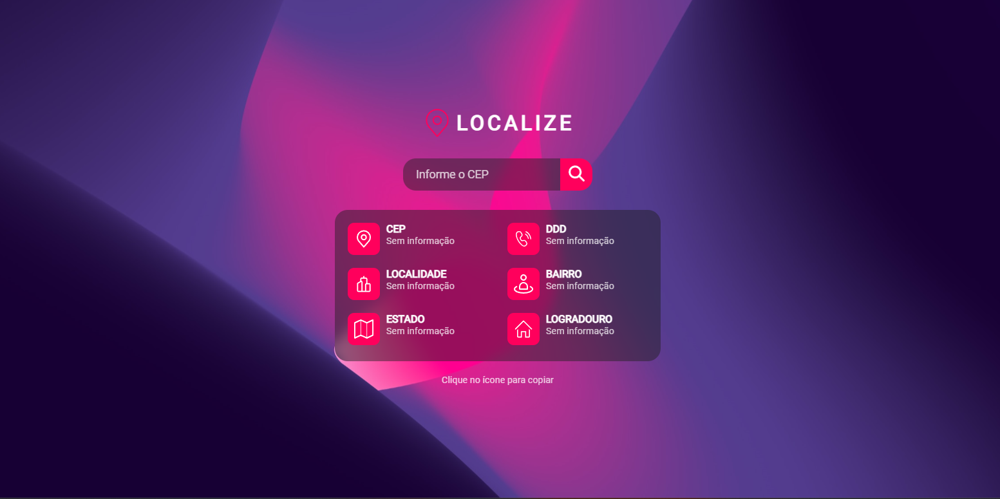

# 💡 Pesquisar CEP




## 📝 Sobre
Projeto desenvolvido para estudos, sendo focado na requisição de API, e o uso dela no JavaScript e HTML.


## 🔧 Configuração

Execute os seguintes comandos para a configuração do projeto em sua maquina:
```
npm i
```


## 🚀 Funcionamento

Execute o comando para iniciar o projeto:
```
npm start
```

## 🤝 Colaboradores

<table>
  <tr>
    <td align="center">
      <a href="https://github.com/hxmoura" width="100px;">
        
        <br>
        <strong>Henrique Moura</strong>
      </a>
    </td>
  </tr>
</table>